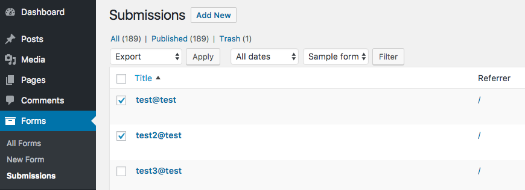

# WPLF Export
[](http://www.gnu.org/licenses/gpl-3.0.html)

Export form submissions created by WP Libre Form.

This builds on a "new" feature added in WP 4.7 called bulk actions, and basically adds a new item to the bulk action menu.

## Installation

### The Composer Way (preferred)

Install the plugin via [Composer](https://getcomposer.org/)
```
composer require k1sul1/wplf-export
```

# How to use

Seriously? Select your forms, select Export from bulk action menu and press "Apply".
For best results, select only one type of form for export.



# Customizing your export

You can add your own filters to be applied on all or invidual forms and get only the output you'll need.
Note that invidual form filters work only when you spesify a form using the "Filter by form" field.

Filter fields:

```
add_filter('wplf_export_form_filter', function($filter_fn) {
  // Note that we're replacing $filter_fn entirely. Return a function!
  $fn = function($field_name) {
    return $field_name !== 'block_this_field';
  };

  return $fn;
});

add_filter('wplf_export_form_84_filter', function($filter_fn) {
  // Same thing.
});
```

Change delimiter (default: ','):

```
add_filter('wplf_export_form_delimiter', function($delimiter) {
  return '#';
});

add_filter('wplf_export_form_84_delimiter', function($delimiter) {
  return '#';
});

```

Change filename (default: wplf_export_TIMESTAMP.csv):

`add_filter('wplf_export_form_{ID}_filename', ..);`


New filters and features are subject to be added. PRs welcome!
